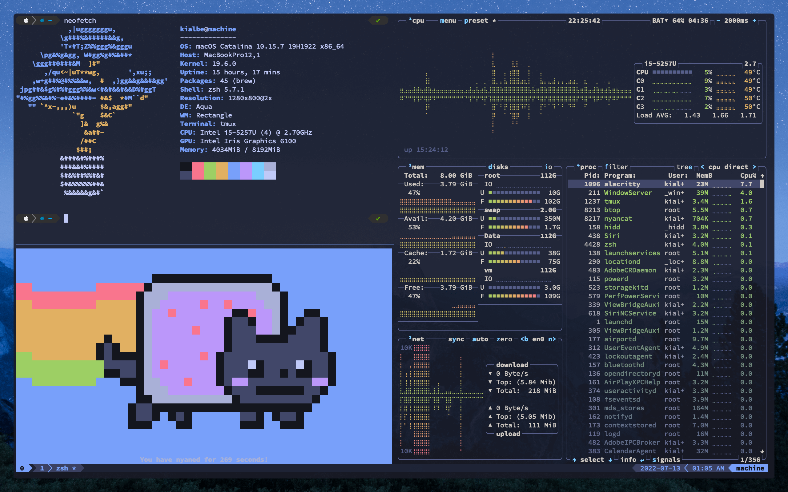
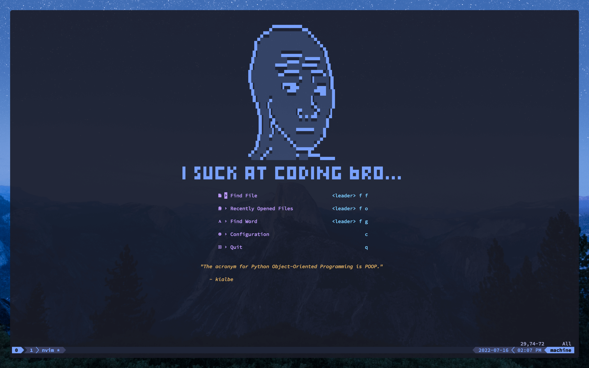
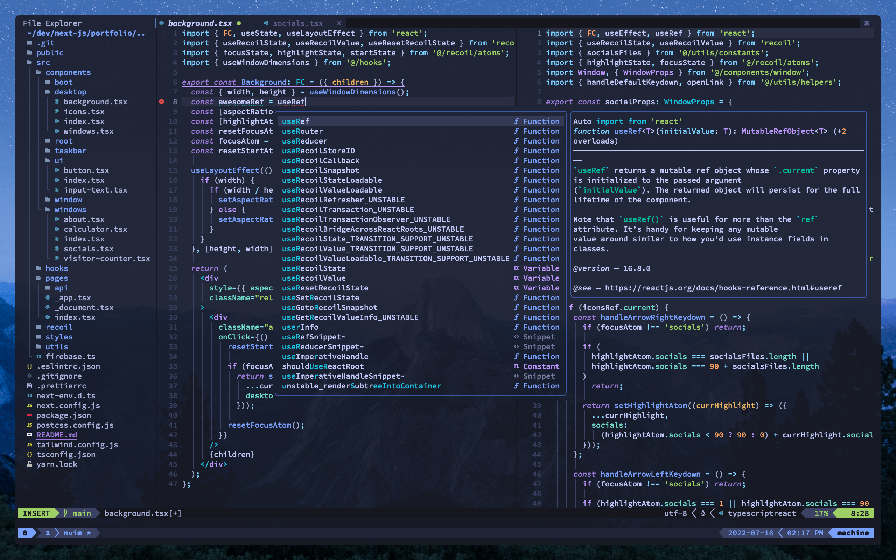

```
██████╗  ██████╗ ████████╗███████╗██╗██╗     ███████╗███████╗
██╔══██╗██╔═══██╗╚══██╔══╝██╔════╝██║██║     ██╔════╝██╔════╝
██║  ██║██║   ██║   ██║   █████╗  ██║██║     █████╗  ███████╗
██║  ██║██║   ██║   ██║   ██╔══╝  ██║██║     ██╔══╝  ╚════██║
██████╔╝╚██████╔╝   ██║   ██║     ██║███████╗███████╗███████║
╚═════╝  ╚═════╝    ╚═╝   ╚═╝     ╚═╝╚══════╝╚══════╝╚══════╝
```

---

Personal dotfiles config.

## Screenshots

### Terminal



### Neovim





## ToDo

- [ ] Create install script.
- **Doc**
  - [x] Add screenshots (alacritty, neofetch, btop, etc...).
- **Neovim**
  - [ ] Add [telescope-media-files](https://github.com/nvim-telescope/telescope-media-files.nvim) extension for Telescope.
  - [ ] Add [kanagawa.nvim](https://github.com/rebelot/kanagawa.nvim) colorscheme plugin.
  - [ ] Add [lspsaga.nvim](https://github.com/glepnir/lspsaga.nvim) plugin?
  - [ ] Add [whichkey.nvim](https://github.com/folke/which-key.nvim) plugin?
- **zsh**
  - [ ] Add [zsh-syntax-highlighting](https://github.com/zsh-users/zsh-syntax-highlighting) plugin.
  - [ ] Add [zsh-autosuggestions](https://github.com/zsh-users/zsh-autosuggestions) plugin.

(⌐■_■)
